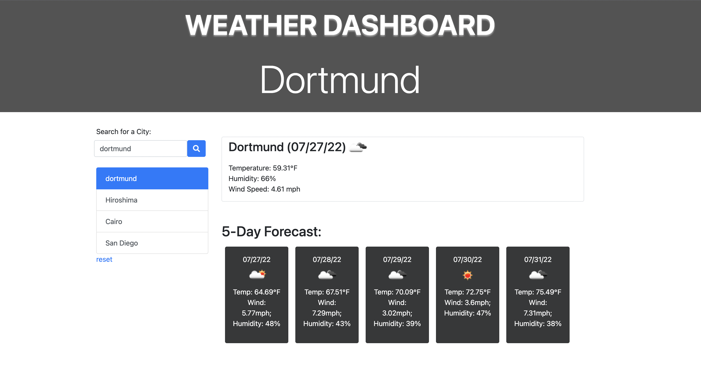

# 06 Server-Side APIs: Weather Dashboard

## Your Task

### URL: https://simpmind.github.io/WeatherDashboard/

## Description
a simple webpage to retrieve weather data for cities. The data includes temperature, wind speed, and humidity. Time will be displayed, and icons will also presented so that users can see if it is cloudy or sunny or rainning.


## User Story

```
AS A traveler
I WANT to see the weather outlook for multiple cities
SO THAT I can plan a trip accordingly
```

## Acceptance Criteria

```
GIVEN a weather dashboard with form inputs
WHEN I search for a city
THEN I am presented with current and future conditions for that city and that city is added to the search history
WHEN I view current weather conditions for that city
THEN I am presented with the city name, the date, an icon representation of weather conditions, the temperature, the humidity, the wind speed, and the UV index
WHEN I view the UV index
THEN I am presented with a color that indicates whether the conditions are favorable, moderate, or severe
WHEN I view future weather conditions for that city
THEN I am presented with a 5-day forecast that displays the date, an icon representation of weather conditions, the temperature, the wind speed, and the humidity
WHEN I click on a city in the search history
THEN I am again presented with current and future conditions for that city
```

## Mock-Up




## Usage
- This webpage display the current weather and forcast of next five days during mid day
- On the left side, there is search box for users to enter the city name
- On the right side, the current weather will be displayed on the top, and the weather of next five days will be at the bottom on the same row as a deskcard
- The search history will be at the bottom of the search box, and users can reset the history.
## Contributor:
Duc Dang ©2022 All Rights Reserved.
- - -
